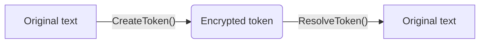

# 🔒 **me.tokenizer**
### *My tokenizer project*

---

## **What is it?**
**me.tokenizer** is a small crypto project. Basically, it's a system that transforms sensitive information (like a phone number `06-12-34-56-78`) into a **weird token** like:

`ol-JDhdh9ugeeufghYUdgefjfejfeufysgUYDGuygefvefusefgsefy`

And if you have the right password, you can recover the original. **Like an encrypted USB drive, but in code.** 🔐

---

## **Why is it stylish??**
✅ **Secure** (I used *Argon2* and *AES-256*, the same as the pros)
✅ **Requires a password** to decrypt (otherwise, it's dead)
✅ **Token expiration** (like milk, it expires)
✅ **Logs everywhere** (I know everything that happens)
✅ **Anti-hacking** (limits brute force attempts)

---

## 🛠 **How ​​does it work?** *basically..*

1. **You enter a text** (like `444-444-444`) + **your password**.
2. **The system throws you a token** like `ol-...`.

3. **If you give the token + the correct password**, it gives you back the original text.



---

## 🔥 **Detailed Features**

### 🔐 **Enhanced Security**
- **Argon2** (apparently better than bcrypt)
- **AES-256** (like in spy movies)
- **Pepper Value** (a secret in addition to the password)
- **Timing Attack Protection**

### 📅 **Token Management**
- **Automatic Expiration** (default / disabled)
- **Purge Old Tokens** (automatic cleanup)

### 📝 **Logs & Monitoring**
- **Everything is logged** (who does what, when, how)
- **Security Alerts** (if someone tries to bruteforce)

---

## ⚙️ **Installation** *(it's easy, I promise :> )*

1. **Download the project**
```bash
git clone https://github.com/yhodamaruu/me.tokenizer.git
cd me.tokenizer
```

2. **Install the dependencies**
```bash
npm install
```

3. **Configure your `.env`** (copy the `.env.example` file and change the values)

4. **Start the server**
```bash
npm start
```

🎉 **Boom, it's ready!**

---

## 📡 **How ​​to use it?** *(API mode)*

### 1️⃣ **Create a token**
**Request:**
```bash
POST /api/tokenize
{ 
"value": "444-444-444", 
"password": "yourSecretPassword"
}
```

**Answer :**
```json
{ 
"token": "ol-JDhdh9ugeeufghYUdgefjfejfeufysgUYDGuygefvefusefgsefy"
}
```

### 2️⃣ **Find the original**
**Request :**
```bash
POST /api/resolve
{ 
"token": "ol-JDhdh9ugeeufghYUdgefjfejfeufysgUYDGuygefvefusefgsefy", 
"password": "yourSecretPassword"
}
```

**Answer :**
```json
{ 
"originalValue": "444-444-444"
}
```

*(If you're wrong, it'll kindly tell you... or not.)* ❌

---

## 🧪 **Tests? Yes, I did some!**
I tested everything with **Jest**.

📊 **Test Coverage:**
- ✅ **Token Creation**
- ✅ **Decryption with Good/Bad Password**
- ✅ **Token Expiration**

To run the tests:
```bash
npm test
```

---

## 📸 **Some Screenshots**

### **1. Creating a Token**

```bash
curl -X POST http://localhost:3000/api/tokenize \
-H "Content-Type: application/json" \
-d '{"value": "my little token", "password": "SuperSecretPassword123!"}' 
{"token":"ol-728f98614477551785d10d9baad34402:45b1d1a33e8a14b0c9678743aa96db81a752248af5cd2006b5b71a69df c2e05967b88086e6177b55948623676df5d83f7adbfee44698b30895a61867a6f8f572203fe88a0a13fdd5415982dfd494b1fe"}'

```

### **3. Result if the password is correct**


```bash
yhodamaruu@mbpdeyhodamaruu ~ % curl -X POST http://localhost:3000/api/resolve \
-H "Content-Type: application/json" \
-d '{
"token": "ol-728f98614477551785d10d9baad34402:45b1d1a33e8a14b0c9678743aa96db81a752248af5cd2006b5b71a69dfc2e0 5967b88086e6177b55948623676df5d83f7adbfee44698b30895a61867a6f8f572203fe88a0a13fdd5415982dfd494b1fe", 
"password": "SuperSecretPassword123!" }'
{"originalValue":"my little token"}%
yhodamaru@mbpdeyhodamaru ~ %
```

### **3. Error if password is wrong**
*(When you forgot your password... 😅)*


```bash

yhodamaru@mbpdeyhodamaru ~ % curl -X POST http://localhost:3000/api/resolve \
-H "Content-Type: application/json" \
-d '{
"token": "ol-d5cc25c4eab453c28496ad5a5c920f61:509f9b6be94f40970732eeb29c478d2d26e7f56cdb343bca5b1cab5a8834b3 6b583f4be9e418bee154e32015f7b323043c9f44df5b52e34580a8e33635e5be36a1eb1c0f357de8fe676318e84661d328", 
"password": "bad passwords" }'
{"error":"Input buffers must have the same byte length"}%
```
---


## 🤔 **Why did I do that?**
- **Because crypto is actually cool.**
- **To learn how encryption works.**
- **Because someone told me to "Do a secure project."**

*(And also because I like coding security stuff.)* 💻