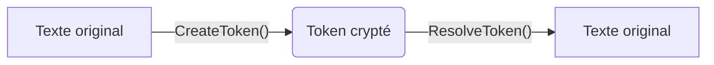

# 🔒 **me.tokenizer**  
### *Mon projet de tokenizer*  

---

##  **C'est quoi ?**  
**me.tokenizer**, c'est un p'tit projet de crypto. En gros c un système qui transforme des trucs sensibles (genre un numéro de téléphone `06-12-34-56-78`) en un **token bizarre** genre :  

`ol-JDhdh9ugeeufghYUdgefjfejfeufysgUYDGuygefvefusefgsefy`  

Et si t’as le bon mot de passe, tu peux retrouver l’original. **Comme une clé USB cryptée, mais en code.** 🔐  

---

## ✨ **Pourquoi c'est styler ??**  
✅ **Sécurisé** (j’ai utilisé *Argon2* et *AES-256* les mêmes que les pros)  
✅ **Besoin d’un mot de passe** pour décoder (sinon, c’est mort)  
✅ **Expiration des tokens** (comme le lait ca se périme)  
✅ **Logs partout** (je sais tout ce qui se passe)  
✅ **Anti-piratage** (limite les tentatives de force brute)  

---

## 🛠 **Comment ça marche ?** * en gros..*  

1. **Tu donnes un texte** (genre `444-444-444`) + **ton mot de passe**.  
2. **Le système te balance un token** genre `ol-...`.  
3. **Si tu redonnes le token + le bon mot de passe**, il te rend le texte original.  



---

## 🔥 **Fonctionnalités détaillées**  

### 🔐 **Sécurité renforcée**  
- **Argon2** (meilleur que bcrypt paraîtil)  
- **AES-256** (comme dans les films d’espionnage)  
- **Pepper value** (un secret en plus du mot de passe)  
- **Timing attack protection**   

### 📅 **Gestion des tokens**  
- **Expiration automatique** (par défaut / désactiver)  
- **Purge des vieux tokens** (nettoyage automatique)  

### 📝 **Logs & Monitoring**  
- **Tout est loggé** (qui fait quoi quand comment)  
- **Alertes sécurité** (si qlq essaie de bruteforce)  

---

## ⚙️ **Installation** *(c’est facile, promis :> )*  

1. **Télécharge le projet**  
   ```bash
   git clone https://github.com/yhodamaruu/me.tokenizer.git
   cd me.tokenizer
   ```

2. **Installe les dépendances**  
   ```bash
   npm install
   ```

3. **Configure ton `.env`** (copie le fichier `.env.example` et change les valeurs)  

4. **Lance le serveur**  
   ```bash
   npm start
   ```

🎉 **Boom, c’est prêt !**  

---

## 📡 **Comment l’utiliser ?** *(API mode)*  

### 1️⃣ **Créer un token**  
**Requête :**  
```bash
POST /api/tokenize
{
  "value": "444-444-444",
  "password": "tonMotDePasseSecret"
}
```

**Réponse :**  
```json
{
  "token": "ol-JDhdh9ugeeufghYUdgefjfejfeufysgUYDGuygefvefusefgsefy"
}
```

### 2️⃣ **Retrouver l’original**  
**Requête :**  
```bash
POST /api/resolve
{
  "token": "ol-JDhdh9ugeeufghYUdgefjfejfeufysgUYDGuygefvefusefgsefy",
  "password": "tonMotDePasseSecret"
}
```

**Réponse :**  
```json
{
  "originalValue": "444-444-444"
}
```

*(Si t’as faux, ça te le dira gentiment… ou pas.)* ❌  

---

## 🧪 **Tests ? Oui, j’en ai fait !**  
J’ai tout testé avec **Jest**.  

📊 **Couverture de tests :**  
- ✅ **Création de token**  
- ✅ **Décodage avec bon/mauvais mot de passe**  
- ✅ **Expiration des tokens**  

Pour lancer les tests :  
```bash
npm test
```

---

## 📸 **Quelques screenshots**   

### **1. Création d’un token**  


```bash
 curl -X POST http://localhost:3000/api/tokenize \
    -H "Content-Type: application/json" \  
    -d '{"value": "mon ptit token", "password": "SuperSecretPassword123!"}'
        {"token":"ol-728f98614477551785d10d9baad34402:45b1d1a33e8a14b0c9678743aa96db81a752248af5cd2006b5b71a69dfc2e05967b88086e6177b55948623676df5d83f7adbfee44698b30895a61867a6f8f572203fe88a0a13fdd5415982dfd494b1fe"}'

```

### **3. Résultat si le mot de passe est correcte**  
  


```bash
yhodamaruu@mbpdeyhodamaruu ~ % curl -X POST http://localhost:3000/api/resolve \
    -H "Content-Type: application/json" \
    -d '{
     "token": "ol-728f98614477551785d10d9baad34402:45b1d1a33e8a14b0c9678743aa96db81a752248af5cd2006b5b71a69dfc2e05967b88086e6177b55948623676df5d83f7adbfee44698b30895a61867a6f8f572203fe88a0a13fdd5415982dfd494b1fe",
    "password": "SuperSecretPassword123!" }'
    {"originalValue":"mon ptit token"}%                                             
yhodamaru@mbpdeyhodamaru ~ %    
```

### **3. Erreur si mot de passe faux**  
*(Quand t’as oublié ton mdp... 😅)*  

  
```bash

yhodamaru@mbpdeyhodamaru ~ % curl -X POST http://localhost:3000/api/resolve \
  -H "Content-Type: application/json" \
  -d '{
    "token": "ol-d5cc25c4eab453c28496ad5a5c920f61:509f9b6be94f40970732eeb29c478d2d26e7f56cdb343bca5b1cab5a8834b36b583f4be9e418bee154e32015f7b323043c9f44df5b52e34580a8e33635e5be36a1eb1c0f357de8fe676318e84661d328",
    "password": "mauvais mots de passe" }'  
{"error":"Input buffers must have the same byte length"}%    
```
---


## 🤔 **Pourquoi j’ai fait ça ?**  
- **Parce que la crypto, c’est cool en vrai.**  
- **Pour apprendre comment marche le chiffrement.**  
- **Parce que on m'a dit "Fais un projet secure".**  

*(Et aussi parce que j’aime bien coder des trucs de securité.)* 💻  

---

## 📜 **Licence**  
**MIT** → Tu peux l’utiliser, le modifier, le partager. Juste, mets mon nom quelque part. 😉  

---

## 🔗 **Liens utiles**  
- [Documentation Argon2](https://en.wikipedia.org/wiki/Argon2) *(le hash que j’utilise)*  
- [AES-256 expliqué](https://fr.wikipedia.org/wiki/Advanced_Encryption_Standard) *(pour les curieux)*  

---

**Fin.** 🚀 *(Allez, je retourne coder.)*